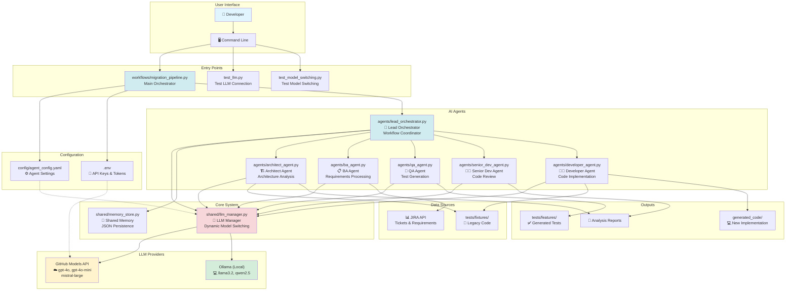
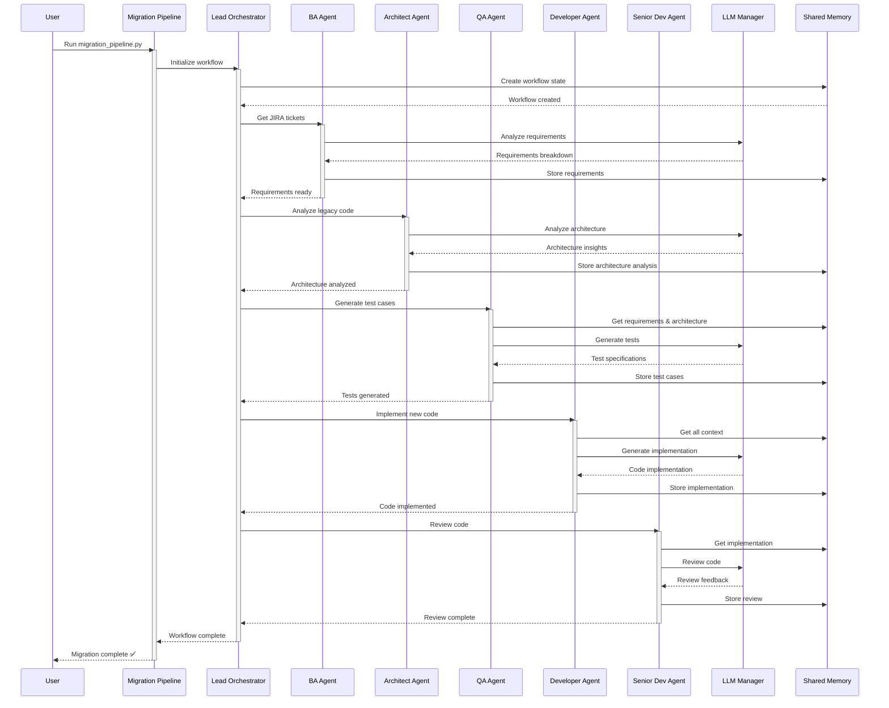
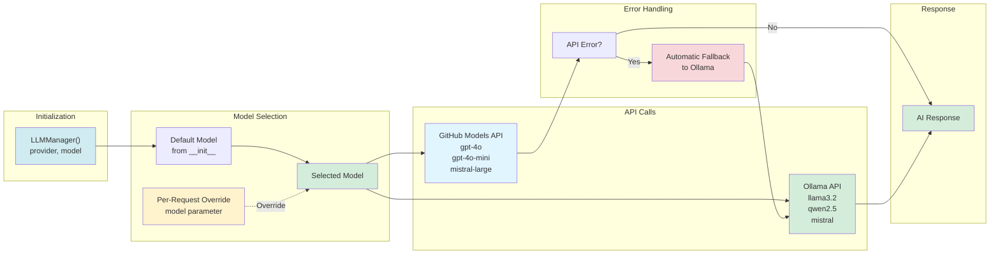
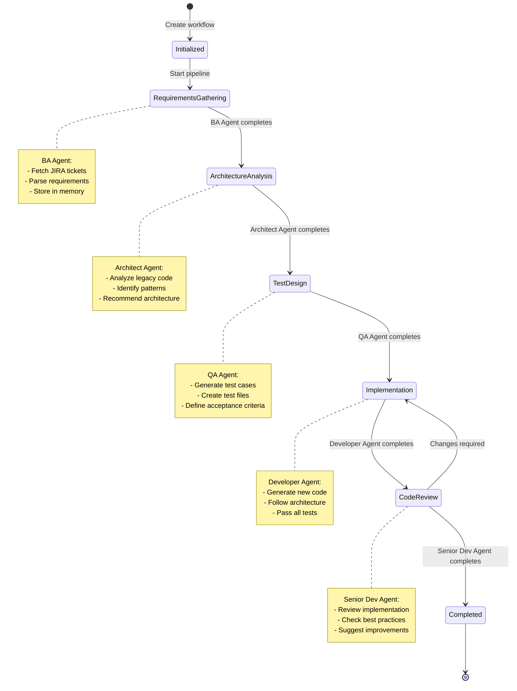
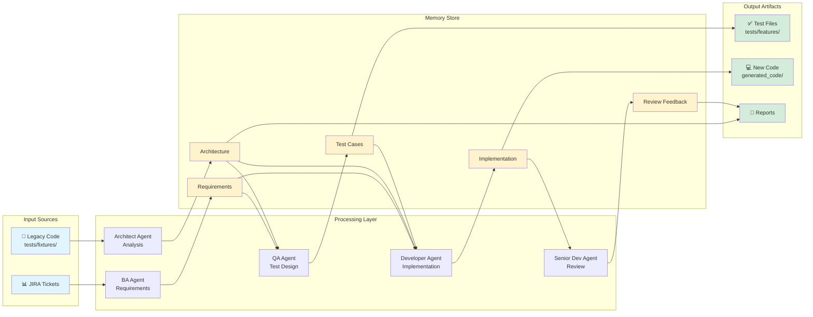

# AI Team - Project Architecture

This document explains the AI-powered legacy code migration system using Mermaid diagrams.

## System Overview



## Workflow Sequence



## LLM Manager - Model Switching



## Agent Workflow States



## File Structure

```mermaid
flowchart TB
    subgraph "Project Root"
        ROOT["📁 /Users/joeylam/repo/aiteam/"]
    end
    
    subgraph "Configuration Files"
        ENV_FILE[".env<br/>🔐 GITHUB_TOKEN<br/>JIRA_API_TOKEN"]
        CONFIG_FILE["config/agent_config.yaml<br/>⚙️ LLM settings<br/>Workflow config"]
        REQ_FILE["requirements.txt<br/>📦 Dependencies"]
    end
    
    subgraph "Core Modules"
        SHARED["📁 shared/"]
        LLM_PY["llm_manager.py<br/>🧠 Model switching"]
        MEMORY_PY["memory_store.py<br/>💾 JSON persistence"]
    end
    
    subgraph "Agent Modules"
        AGENTS["📁 agents/"]
        LEAD_PY["lead_orchestrator.py"]
        ARCH_PY["architect_agent.py"]
        BA_PY["ba_agent.py"]
        QA_PY["qa_agent.py"]
        SENIOR_PY["senior_dev_agent.py"]
        DEV_PY["developer_agent.py"]
    end
    
    subgraph "Workflows"
        WORKFLOWS["📁 workflows/"]
        PIPE_PY["migration_pipeline.py<br/>🚀 Main entry point"]
    end
    
    subgraph "Test Files"
        TESTS["📁 tests/"]
        FIXTURES["fixtures/<br/>📁 Legacy code"]
        FEATURES["features/<br/>📁 Generated tests"]
    end
    
    subgraph "Test Scripts"
        TEST_LLM_PY["test_llm.py<br/>✅ Test connection"]
        TEST_MODELS_PY["test_model_switching.py<br/>✅ Test switching"]
        TEST_CLAUDE["test_claude_models.py<br/>✅ Check Claude"]
    end
    
    ROOT --> ENV_FILE
    ROOT --> CONFIG_FILE
    ROOT --> REQ_FILE
    ROOT --> SHARED
    ROOT --> AGENTS
    ROOT --> WORKFLOWS
    ROOT --> TESTS
    ROOT --> TEST_LLM_PY
    ROOT --> TEST_MODELS_PY
    ROOT --> TEST_CLAUDE
    
    SHARED --> LLM_PY
    SHARED --> MEMORY_PY
    
    AGENTS --> LEAD_PY
    AGENTS --> ARCH_PY
    AGENTS --> BA_PY
    AGENTS --> QA_PY
    AGENTS --> SENIOR_PY
    AGENTS --> DEV_PY
    
    WORKFLOWS --> PIPE_PY
    
    TESTS --> FIXTURES
    TESTS --> FEATURES
    
    style ROOT fill:#e1f5ff
    style SHARED fill:#fff3cd
    style AGENTS fill:#d4edda
    style WORKFLOWS fill:#f8d7da
    style TESTS fill:#d1ecf1
```



## Data Flow



## Key Features

### 🎯 Dynamic Model Switching
- **Initialize with default model**: `LLMManager("github_copilot_cli", model="gpt-4o")`
- **Override per request**: `llm.generate(prompt, model="gpt-4o-mini")`
- **Automatic fallback**: GitHub Models → Ollama (if API fails)

### 🤖 Six Specialized AI Agents
1. **Lead Orchestrator**: Coordinates entire workflow
2. **Architect Agent**: Analyzes legacy code architecture
3. **BA Agent**: Processes JIRA tickets and requirements
4. **QA Agent**: Generates comprehensive test cases
5. **Developer Agent**: Implements new code
6. **Senior Dev Agent**: Reviews and validates code

### 💾 Shared Memory System
- Persistent JSON storage
- Cross-agent data sharing
- Workflow state management
- Timestamped entries

### ☁️ Dual LLM Support
- **GitHub Models API**: GPT-4o, GPT-4o-mini, Mistral-large
- **Ollama (Local)**: llama3.2, qwen2.5, mistral (unlimited, free)

### ⚙️ Configurable Workflow
- YAML-based configuration
- Environment variable support
- Parallel processing options
- Retry mechanisms

## Quick Start Commands

```bash
# Run full migration pipeline
python3 workflows/migration_pipeline.py

# Test LLM connection
python3 test_llm.py

# Test model switching
python3 test_model_switching.py

# Check Claude models availability
python3 test_claude_models.py
```

## Environment Variables

```bash
# Required for GitHub Models API
GITHUB_TOKEN=ghp_your_token_here

# Optional for JIRA integration
JIRA_API_TOKEN=your_jira_token

# Optional model defaults
GITHUB_MODEL=gpt-4o
OLLAMA_MODEL=llama3.2
LLM_PROVIDER=github_copilot_cli
```

---

**📚 For more information, see:**
- `README_START_HERE.md` - Getting started guide
- `MODEL_SWITCHING_GUIDE.md` - Model switching documentation (if exists)
- `GITHUB_MODELS_SETUP.md` - GitHub Models API setup
